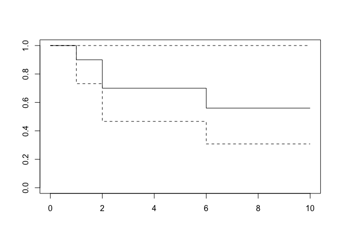

Survival Analysis
================
Roxy Zhang
4/19/2022

## Question 2

``` r
time = c(1, 2, 2, 4, 5, 6, 7, 8, 9, 10)

event = c(1, 1, 1, 0, 0, 1, 0, 0, 0, 0)

surv_obj = Surv(time, event == 1)

km_fit = survfit(surv_obj ~ 1, type = "kaplan-meier")

summary(km_fit)
```

    ## Call: survfit(formula = surv_obj ~ 1, type = "kaplan-meier")
    ## 
    ##  time n.risk n.event survival std.err lower 95% CI upper 95% CI
    ##     1     10       1     0.90  0.0949        0.732            1
    ##     2      9       2     0.70  0.1449        0.467            1
    ##     6      5       1     0.56  0.1706        0.308            1

``` r
plot(km_fit)
```

<!-- -->

``` r
# Kaplan-Meier, Nelson-Aalen, Fleming-Harrington estimate
cbind(km_fit$time, 
      km_fit$surv, 
      cumsum(km_fit$n.event/km_fit$n.risk), 
      exp(-cumsum(km_fit$n.event/km_fit$n.risk)))
```

    ##       [,1] [,2]      [,3]      [,4]
    ##  [1,]    1 0.90 0.1000000 0.9048374
    ##  [2,]    2 0.70 0.3222222 0.7245372
    ##  [3,]    4 0.70 0.3222222 0.7245372
    ##  [4,]    5 0.70 0.3222222 0.7245372
    ##  [5,]    6 0.56 0.5222222 0.5932009
    ##  [6,]    7 0.56 0.5222222 0.5932009
    ##  [7,]    8 0.56 0.5222222 0.5932009
    ##  [8,]    9 0.56 0.5222222 0.5932009
    ##  [9,]   10 0.56 0.5222222 0.5932009
