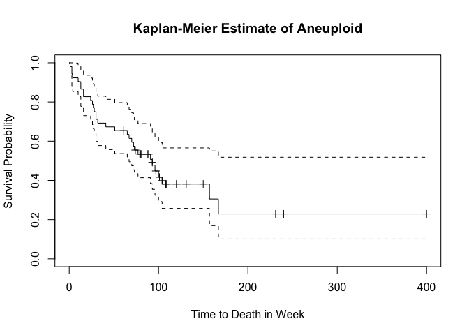
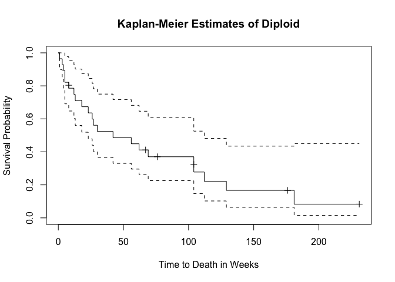

Survival Analysis
================
Roxy Zhang
4/19/2022

## Question 2

``` r
time = c(1, 2, 2, 4, 5, 6, 7, 8, 9, 10)

event = c(1, 1, 1, 0, 0, 1, 0, 0, 0, 0)

surv_obj = Surv(time, event == 1)

km_fit = survfit(surv_obj ~ 1, type = "kaplan-meier")

summary(km_fit)
```

    ## Call: survfit(formula = surv_obj ~ 1, type = "kaplan-meier")
    ## 
    ##  time n.risk n.event survival std.err lower 95% CI upper 95% CI
    ##     1     10       1     0.90  0.0949        0.732            1
    ##     2      9       2     0.70  0.1449        0.467            1
    ##     6      5       1     0.56  0.1706        0.308            1

``` r
plot(km_fit)
```

<!-- -->

``` r
# Kaplan-Meier, Nelson-Aalen, Fleming-Harrington estimate
cbind(km_fit$time, 
      km_fit$surv, 
      cumsum(km_fit$n.event/km_fit$n.risk), 
      exp(-cumsum(km_fit$n.event/km_fit$n.risk)))
```

    ##       [,1] [,2]      [,3]      [,4]
    ##  [1,]    1 0.90 0.1000000 0.9048374
    ##  [2,]    2 0.70 0.3222222 0.7245372
    ##  [3,]    4 0.70 0.3222222 0.7245372
    ##  [4,]    5 0.70 0.3222222 0.7245372
    ##  [5,]    6 0.56 0.5222222 0.5932009
    ##  [6,]    7 0.56 0.5222222 0.5932009
    ##  [7,]    8 0.56 0.5222222 0.5932009
    ##  [8,]    9 0.56 0.5222222 0.5932009
    ##  [9,]   10 0.56 0.5222222 0.5932009

## Question 3

``` r
data("tongue")

aneuploid = subset(tongue, type == 1)
diploid = subset(tongue, type == 2)

aneuploid$surv_obj <- with(aneuploid, Surv(time, delta == 1))
diploid$surv_obj <- with(diploid , Surv(time, delta == 1))

km_aneuploid <- survfit(surv_obj ~ type, 
                        conf.type="log",
                        type = "kaplan-meier", 
                        data = aneuploid)

summary(km_aneuploid)
```

    ## Call: survfit(formula = surv_obj ~ type, data = aneuploid, conf.type = "log", 
    ##     type = "kaplan-meier")
    ## 
    ##  time n.risk n.event survival std.err lower 95% CI upper 95% CI
    ##     1     52       1    0.981  0.0190        0.944        1.000
    ##     3     51       2    0.942  0.0323        0.881        1.000
    ##     4     49       1    0.923  0.0370        0.853        0.998
    ##    10     48       1    0.904  0.0409        0.827        0.988
    ##    13     47       2    0.865  0.0473        0.777        0.963
    ##    16     45       2    0.827  0.0525        0.730        0.936
    ##    24     43       1    0.808  0.0547        0.707        0.922
    ##    26     42       1    0.788  0.0566        0.685        0.908
    ##    27     41       1    0.769  0.0584        0.663        0.893
    ##    28     40       1    0.750  0.0600        0.641        0.877
    ##    30     39       2    0.712  0.0628        0.598        0.846
    ##    32     37       1    0.692  0.0640        0.578        0.830
    ##    41     36       1    0.673  0.0651        0.557        0.813
    ##    51     35       1    0.654  0.0660        0.537        0.797
    ##    65     33       1    0.634  0.0669        0.516        0.780
    ##    67     32       1    0.614  0.0677        0.495        0.762
    ##    70     31       1    0.594  0.0683        0.475        0.745
    ##    72     30       1    0.575  0.0689        0.454        0.727
    ##    73     29       1    0.555  0.0693        0.434        0.709
    ##    77     27       1    0.534  0.0697        0.414        0.690
    ##    91     19       1    0.506  0.0715        0.384        0.667
    ##    93     18       1    0.478  0.0728        0.355        0.644
    ##    96     16       1    0.448  0.0741        0.324        0.620
    ##   100     14       1    0.416  0.0754        0.292        0.594
    ##   104     12       1    0.381  0.0767        0.257        0.566
    ##   157      5       1    0.305  0.0918        0.169        0.550
    ##   167      4       1    0.229  0.0954        0.101        0.518

``` r
plot(km_aneuploid,
     mark.time = T,
     main="Kaplan-Meier Estimate of Aneuploid",
     ylab = "Survival Probability", 
     xlab = "Time to Death in Week")
```

<!-- -->

``` r
km_diploid = survfit(surv_obj~type, 
                     conf.type="log",
                     type = "kaplan-meier",
                     data=diploid)

summary(km_diploid)
```

    ## Call: survfit(formula = surv_obj ~ type, data = diploid, conf.type = "log", 
    ##     type = "kaplan-meier")
    ## 
    ##  time n.risk n.event survival std.err lower 95% CI upper 95% CI
    ##     1     28       1   0.9643  0.0351       0.8979        1.000
    ##     3     27       1   0.9286  0.0487       0.8379        1.000
    ##     4     26       1   0.8929  0.0585       0.7853        1.000
    ##     5     25       2   0.8214  0.0724       0.6911        0.976
    ##     8     23       1   0.7857  0.0775       0.6475        0.953
    ##    12     21       1   0.7483  0.0824       0.6031        0.929
    ##    13     20       1   0.7109  0.0863       0.5603        0.902
    ##    18     19       1   0.6735  0.0895       0.5190        0.874
    ##    23     18       1   0.6361  0.0921       0.4790        0.845
    ##    26     17       1   0.5986  0.0939       0.4402        0.814
    ##    27     16       1   0.5612  0.0952       0.4025        0.783
    ##    30     15       1   0.5238  0.0959       0.3658        0.750
    ##    42     14       1   0.4864  0.0961       0.3302        0.716
    ##    56     13       1   0.4490  0.0957       0.2956        0.682
    ##    62     12       1   0.4116  0.0948       0.2621        0.646
    ##    69     10       1   0.3704  0.0938       0.2255        0.608
    ##   104      8       2   0.2778  0.0904       0.1468        0.526
    ##   112      5       1   0.2222  0.0877       0.1025        0.482
    ##   129      4       1   0.1667  0.0815       0.0639        0.435
    ##   181      2       1   0.0833  0.0717       0.0155        0.449

``` r
plot(km_diploid, 
     mark.time = T,
     main="Kaplan-Meier Estimates of Diploid",
     ylab = "Survival Probability",
     xlab="Time to Death in Weeks")
```

<!-- -->

``` r
# survival rate at 1 yr (52 weeks), with CI
summary(km_aneuploid,time = c(52))
```

    ## Call: survfit(formula = surv_obj ~ type, data = aneuploid, conf.type = "log", 
    ##     type = "kaplan-meier")
    ## 
    ##  time n.risk n.event survival std.err lower 95% CI upper 95% CI
    ##    52     34      18    0.654   0.066        0.537        0.797

``` r
summary(km_diploid,time = c(52))
```

    ## Call: survfit(formula = surv_obj ~ type, data = diploid, conf.type = "log", 
    ##     type = "kaplan-meier")
    ## 
    ##  time n.risk n.event survival std.err lower 95% CI upper 95% CI
    ##    52     13      14    0.486  0.0961         0.33        0.716
